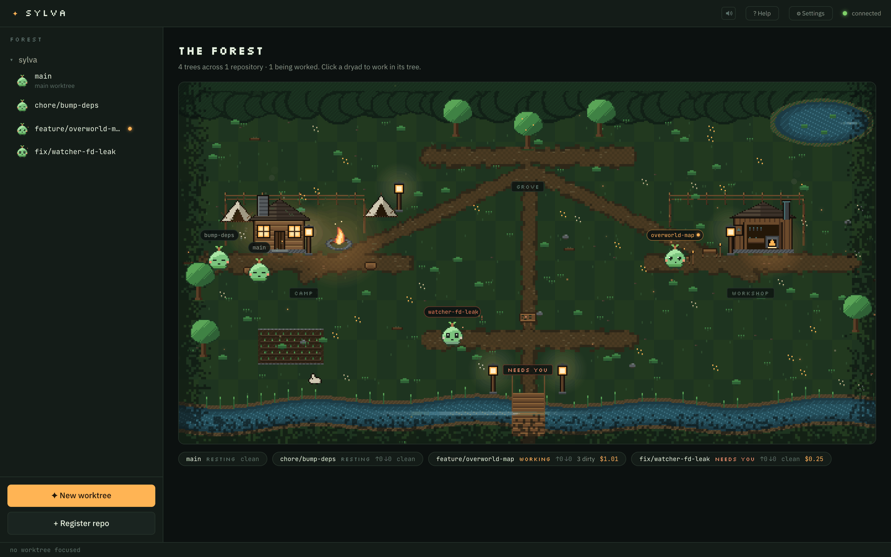
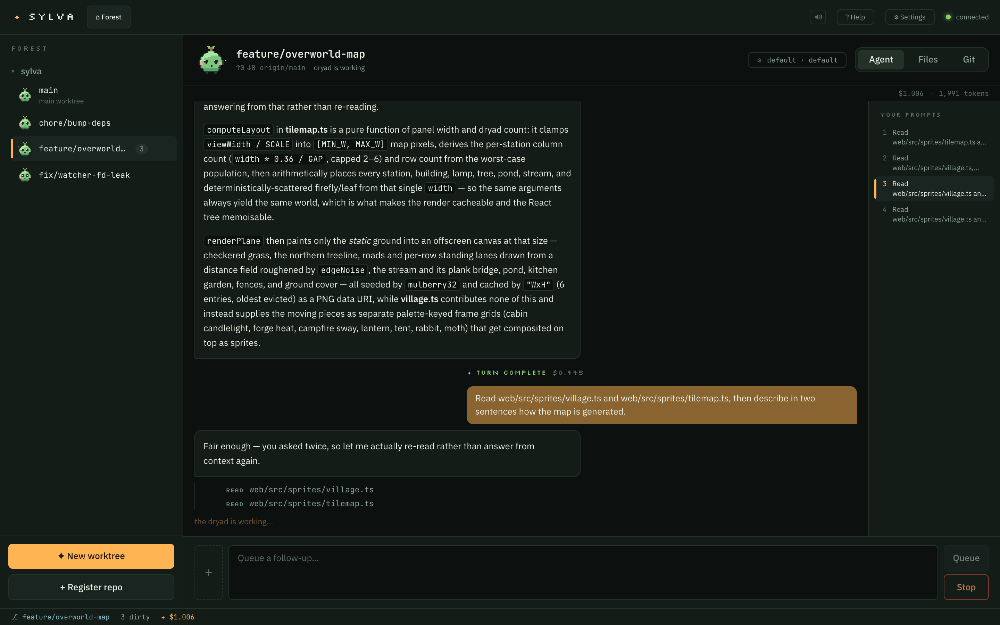
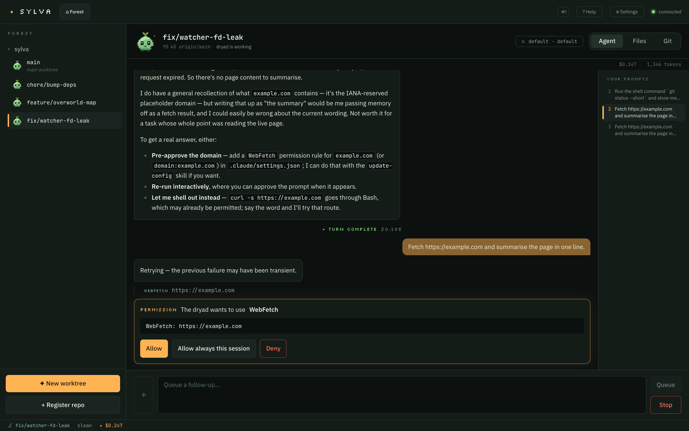
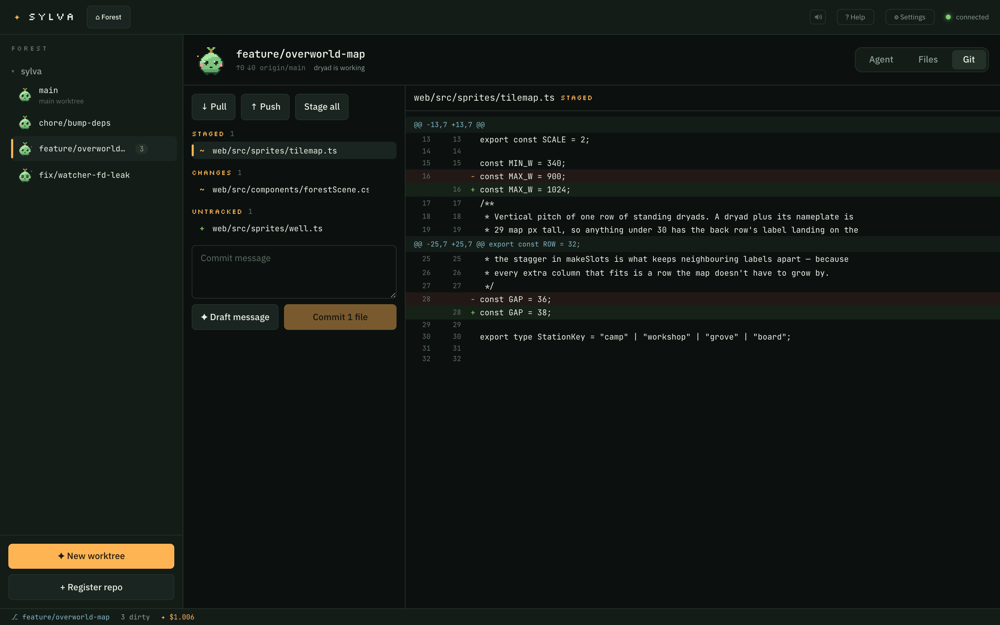

# Sylva 🌲

**Mission control for git worktrees and Claude agents — a forest at night, tended by pixel dryads.**

Run several Claude agents at once, each in its own git worktree, and see what all of them are doing on one screen. Every worktree gets a dryad: it sleeps at the camp when idle, walks to the workshop when its agent starts working, celebrates in the grove when a turn lands, and waits at the notice board when it needs a decision from you.



Sylva runs entirely on your machine. It talks to `git` through the real CLI and to Claude through the [Claude Agent SDK](https://code.claude.com/docs/en/agent-sdk), using the credentials Claude Code already stores — there is no API key to configure and nothing leaves localhost.

---

## Why

Working on three things at once means three worktrees, three terminals, and no idea which agent is blocked on a permission prompt you forgot to answer. Sylva puts the whole set in one place: prompt any worktree, watch files change live, review a diff, commit, and tell at a glance which agents are running, which are done, and which are stuck.

## Features

- **A worktree per task.** Name a branch and Sylva creates the worktree, registers it, and focuses it. Remove it when you're done and the branch and directory go with it.
- **One Claude session per worktree.** Sessions are independent — separate transcripts, separate costs, separate settings — and resume across server restarts.
- **Permissions you can actually see.** Tool requests appear inline with Allow / Allow always this session / Deny. There's an opt-in "skip all permissions" mode behind an explicit confirmation.
- **Live file feed.** A recursive watcher streams every change in the worktree as it happens, ignoring `.git`, `node_modules` and friends.
- **Everyday git.** Status groups, a diff viewer, stage/unstage, commit, branch list, push/pull with an `--set-upstream` offer — plus a "Draft message" button that writes the commit message from the staged diff.
- **The forest map.** All worktrees across all repositories as one overworld, generated to fit whatever width the panel happens to be.
- **Sound, optional.** Synthesized notification cues and an ambient forest bed, with separate volumes and a global mute. No audio files.

## Screenshots

**Talking to an agent** — streamed text, tool calls, per-turn cost, and a rail down the right that jumps to any of your earlier prompts.



**Permissions** — the agent stops and asks before it reaches for a tool. Answering "always" applies for the rest of that session only.



**Git** — staged, changed and untracked grouped separately, with a diff for whichever file you select.



---

## Requirements

- **Node.js ≥ 20** and npm
- **git** on your `PATH`
- **[Claude Code](https://claude.com/claude-code) authenticated on this machine.** Run `claude` once and log in. Sylva reuses those credentials through the Agent SDK; it never reads or stores an API key of its own.

## Quick start

```bash
npm install
npm run dev
```

`npm run dev` starts the API on `:4611` and the Vite dev server on <http://localhost:5173>.

For a production-style single-port build:

```bash
npm run build
npm start          # everything on http://localhost:4611
```

## Using it

1. **Register a repository** — sidebar → **+ Register repo**. Browse to the folder or paste an absolute path.
2. **Grow a worktree** — **✦ New worktree**, then name a branch (`feature/whatever`). Sylva creates the worktree and focuses it.
3. **Prompt the dryad** — the **Agent** tab. Prompts sent while a turn is in flight queue up rather than interrupting.
4. **Watch it work** — **Files** streams changes live; **Git** shows what's staged and lets you commit.
5. **Step back** — **⌂ Forest** shows every worktree at once. Click any dryad to drop into it.

Sessions persist to `~/.sylva/sessions/` and resume through the Agent SDK, so restarting the server doesn't lose a conversation.

## Configuration

| Variable | Default | What it does |
| --- | --- | --- |
| `SYLVA_HOME` | `~/.sylva` | Where the registry, transcripts and attachments live |
| `SYLVA_PORT` | `4611` | Port the API and production build bind to |

Settings live in two layers: a global default (model, reasoning effort, permission mode, text size, sound) and per-worktree overrides. A worktree inherits anything it doesn't override.

## Security

Sylva is a local tool and is built to stay that way.

- The server binds **127.0.0.1 only** and rejects requests with a non-local `Host` or a foreign `Origin`.
- Git runs via `execFile` with argument arrays — no shell, so no interpolation.
- Attachments are written under `~/.sylva/attachments/`, deliberately outside your repositories.
- Claude credentials come from your existing Claude Code login. Sylva doesn't read, copy, or transmit them.

> [!WARNING]
> **"Skip all permissions"** hands the agent `bypassPermissions`. It can then edit, delete, rewrite history and push without asking, and its shell reaches your whole machine — not just the worktree. It is off by default, confirmed explicitly, and settable per worktree. Turn it on only for work you'd be happy to lose.

## Architecture

An npm workspaces monorepo:

| Package | What's in it |
| --- | --- |
| `server/` | Fastify + WebSocket hub. Git through the real CLI with a per-worktree mutation queue. Agents via `@anthropic-ai/claude-agent-sdk` — one active session per worktree. |
| `web/` | Vite + React. Zustand holds live WebSocket state, TanStack Query handles REST. |
| `shared/` | The TypeScript contract for REST payloads and WebSocket events. |

A few things worth knowing if you go reading:

- **File watching** uses Node's recursive `fs.watch` (FSEvents on macOS), which costs one file descriptor per worktree. Chokidar is kept as a fallback for platforms without recursive support — watching per-file opened >10,000 descriptors on a real repository and exhausted the process limit.
- **Nothing ships as an image.** Every sprite, tree, building and map tile is a 24×24 character matrix or a generated pixel grid, painted to a canvas at runtime, turned into a PNG data URI and animated with CSS `steps()`.
- **The map is generated, not authored.** `computeLayout` rebuilds the world at whatever size divides into the panel by a whole display scale, so it never scrolls sideways and pixels stay square at any window size.
- **Sound is synthesized** with the Web Audio API — oscillator cues, and an ambient bed of brown noise, a detuned pad and crickets.

Design notes and specs live in `openspec/`.

## Development

```bash
npm run dev        # server + web, watching
npm run build      # typecheck all three packages and build
npm test           # server test suite — parsers, git queue, store
```

---

## Credits

Built by **[Mark Kenneth Calendario](https://markcalendario.vercel.app/)** — full-stack web developer, Caloocan, Philippines.

[Website](https://markcalendario.vercel.app/) · [GitHub](https://github.com/markcalendario) · [LinkedIn](https://www.linkedin.com/in/markcalendario)
