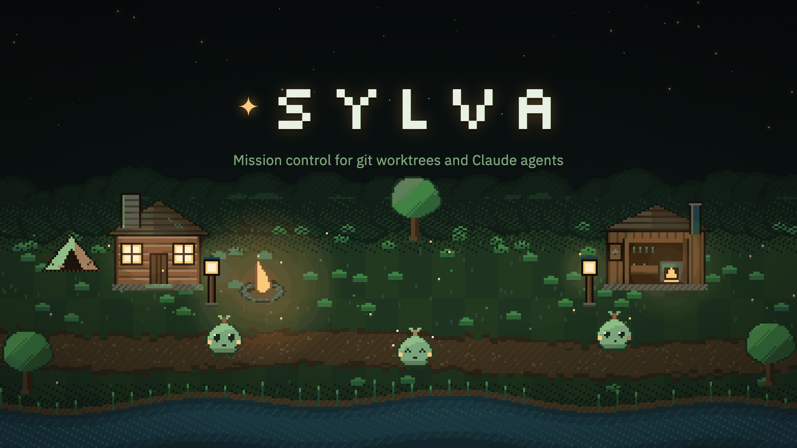

Run several Claude agents at once, each in its own git worktree, and see what all of them are doing on one screen.

Sylva comes in two looks, and opens in **Professional**: black, white and Inter, with colour kept back for the few places it carries something no shade of grey could — a failed check, an added line, a deleted one. **Forest** is the same app with the wood put back. There, every worktree gets a dryad: it sleeps at the camp when idle, walks to the workshop when its agent starts working, celebrates in the grove when a turn lands, and waits at the notice board when it needs a decision from you. One control in Settings switches between them, and the vocabulary follows the palette — what one calls an agent, the other calls a dryad.

Sylva runs entirely on your machine. It talks to `git` through the real CLI and to Claude through the [Claude Agent SDK](https://code.claude.com/docs/en/agent-sdk), using the credentials Claude Code already stores — there is no API key to configure and nothing leaves localhost.

---

## Why

Working on three things at once means three worktrees, three terminals, and no idea which agent is blocked on a permission prompt you forgot to answer. Sylva puts the whole set in one place: prompt any worktree, watch files change live, review a diff, commit, and tell at a glance which agents are running, which are done, and which are stuck.

## Features

- **Two themes, one app.** Professional is the default — the register you want on a screen someone else is looking at. Forest is the night wood: amber light, pixel dryads, the clearing map, and a music box under it. Every rule in the interface is written against design tokens rather than colours, so a theme is a block of variables rather than a second stylesheet, and the words, the sounds and the map change with it.
- **A worktree per task.** Name a branch and Sylva creates the worktree, registers it, and opens it — fetching first, by default, so it starts from what the remote has rather than from whatever you last pulled. Remove it when you're done and the directory goes, along with the registration git keeps for it; tick the box in the same dialog and the branch goes too. New repositories can be started from inside Sylva too — initialized, committed, and ready for worktrees.
- **One agent, several worktrees.** Shift-click a worktree in the sidebar, pick a few more, and they share a single session — so it can read the old system and write the new one in the same turn, remembering both.
- **One Claude session per worktree.** Sessions are independent — separate transcripts, separate costs, separate settings — and resume across server restarts. **Clear** in the Agent header sends one back to a blank slate: transcript deleted, cost back to zero, the next prompt starting a conversation of its own.
- **`@`, `/` and attachments in the prompt box.** `@` completes a path across everything the agent can reach, so naming a file doesn't mean typing it from memory. `/` lists the commands and skills this worktree actually offers — read from the agent itself, so a command the repository adds shows up beside the built-in ones. A file you attach, drop or paste writes its path into the sentence *where the caret was*, so you can point at it mid-thought rather than append a list.
- **The assistant.** An agent bound to no worktree at all, which knows where every registered repository lives. For the questions that span all of them. (The Forest theme calls it the grove.)
- **Permissions you can actually see.** Tool requests appear inline with Allow / Allow always this session / Deny. There's an opt-in "skip all permissions" mode behind an explicit confirmation.
- **Live file feed.** A recursive watcher streams every change in the worktree as it happens, ignoring `.git`, `node_modules` and friends.
- **Everyday git.** Staged, changed and untracked in their own groups, a diff for whichever file you pick, and stage, unstage, open and discard on every row. Pull and Push carry their own counts, so "is there anything waiting on the remote" is answered on the button that does something about it — with an `--set-upstream` offer when the branch tracks nothing yet. The branch's own pull request sits above the change list with its checks, its review and its conflicts, and "Draft message" writes the commit message from the staged diff. Hover any commit in the history for its body, both identities, dates and diffstat — and click it to open every file it touched, each with its diff as that commit left it.
- **Real terminals.** As many shells per worktree as the work needs, each a proper pty: prompts, colour, `^C`, `git rebase -i`, `vim`. They belong to the server, so they keep running when you switch tabs, reload the page or close the window. Your project command is one button away — it is typed into a fresh shell you can then keep using.
- **One page for all of them.** Every worktree across every repository at once — a roster with the counts, the costs and who is blocked, and in the Forest theme an overworld map drawn above it, generated to fit whatever width the panel happens to be.
- **Sound, optional.** Synthesized notification cues and an ambient bed, with separate volumes and a global mute — a forest at night under one theme, something quieter and stringed under the other. No audio files.

## Screenshots

Sylva opens in Professional. The shots below are in **Forest**, which is the louder half of the same app: identical panels, identical counts, identical controls, with the palette, the sprites and the nouns swapped. If you are looking for what it does rather than what it looks like, these answer the first question in either theme.

**Git** — the branch's remote at the top, with the counts on the buttons that act on them; staged, changed and untracked in their own groups; the branch's pull request above the list; and a diff for whichever file you pick.


**Talking to an agent** — streamed text, tool calls, per-turn cost, and a rail down the right that jumps to any of your earlier prompts.


**Permissions** — the agent stops and asks before it reaches for a tool. Answering "always" applies for the rest of that session only.


**The forest** — every worktree across every repository on one map, generated to fit the panel. Here: two dryads resting at the camp, one at work in the shed, one waiting at the notice board for a permission decision. Professional draws the same set as the roster underneath it, and no map.


---

## Requirements

- **Node.js ≥ 20** and npm
- **git** on your `PATH`
- **[Claude Code](https://claude.com/claude-code) authenticated on this machine.** Run `claude` once and log in. Sylva reuses those credentials through the Agent SDK; it never reads or stores an API key of its own.

## Quick start

```bash
npm install
npm run dev
```

`npm run dev` starts the API on `:4611` and the Vite dev server on <http://localhost:5173>.

For a production-style single-port build:

```bash
npm run build
npm start          # everything on http://localhost:4611
```

## Using it

1. **Add a repository** — sidebar → **+ Register repo**. Register one that exists, or switch to **Create new** to start one from scratch.
2. **Grow a worktree** — **✦ New worktree**, then name a branch (`feature/whatever`). Sylva creates the worktree and opens it.
3. **Prompt the agent** — the **Agent** tab. Prompts sent while a turn is in flight queue up rather than interrupting.
4. **Watch it work** — **Files** streams changes live and searches by name or by what's written inside; **Git** shows what's staged, lists open pull requests, lets you commit, and opens any commit in the history to see what it changed; **Terminal** gives you shells in the worktree.
5. **Work on two worktrees at once** — to put two of them under *one* agent, shift-click them in the sidebar; they appear together under **shared**.
6. **Step back** — **Workspace** shows every worktree at once, and **Assistant** talks to the agent that belongs to none of them. (In the Forest theme the same two are called **Forest** and **Grove**.)
7. **Change the look** — **⚙ Settings → Theme**. Professional is where Sylva starts; Forest is one click away, and the choice is remembered in this browser.

Sessions persist to `~/.sylva/sessions/` and resume through the Agent SDK, so restarting the server doesn't lose a conversation. Terminals do not: they are real processes, and they end when the server does — and what one said ends with it, on the server and in the browser both. Settings live on their own page behind **⚙ Settings**, including which shell terminals open, how far they scroll back, and the project command each repository runs.

## Configuration

| Variable | Default | What it does |
| --- | --- | --- |
| `SYLVA_HOME` | `~/.sylva` | Where the registry, transcripts and attachments live |
| `SYLVA_PORT` | `4611` | Port the API and production build bind to |

Settings live in two layers: a global default (model, reasoning effort, permission mode, text size, sound) and per-worktree overrides. A worktree inherits anything it doesn't override.

The theme is the exception — it belongs to the browser rather than to the workspace, so it is kept in `localStorage` and applied before React mounts. Sylva starts in Professional; a machine that has never been told otherwise gets black and white.

## Security

Sylva is a local tool and is built to stay that way.

- The server binds **127.0.0.1 only** and rejects requests with a non-local `Host` or a foreign `Origin`.
- Git runs via `execFile` with argument arrays — no shell, so no interpolation.
- Terminals are ordinary shells running as you, in the worktree directory. They are as powerful as the machine they run on, which is the point — but it means the security boundary is the loopback interface, not the terminal.
- Attachments are written under `~/.sylva/attachments/`, deliberately outside your repositories. The path is what goes to the agent; the file is copied, never moved.
- Claude credentials come from your existing Claude Code login. Sylva doesn't read, copy, or transmit them.

> [!WARNING]
> **"Skip all permissions"** hands the agent `bypassPermissions`. It can then edit, delete, rewrite history and push without asking, and its shell reaches your whole machine — not just the worktree. It is off by default, confirmed explicitly, and settable per worktree. Turn it on only for work you'd be happy to lose.

## Architecture

An npm workspaces monorepo:

| Package | What's in it |
| --- | --- |
| `server/` | Fastify + WebSocket hub. Git through the real CLI with a per-worktree mutation queue. Agents via `@anthropic-ai/claude-agent-sdk` — one active session per worktree. Terminals as real ptys via `node-pty`. |
| `web/` | Vite + React. Zustand holds live WebSocket state, TanStack Query handles REST, `@xterm/xterm` draws the terminals. |
| `shared/` | The TypeScript contract for REST payloads and WebSocket events. |

A few things worth knowing if you go reading:

- **File watching** uses Node's recursive `fs.watch` (FSEvents on macOS), which costs one file descriptor per worktree. Chokidar is kept as a fallback for platforms without recursive support — watching per-file opened >10,000 descriptors on a real repository and exhausted the process limit.
- **Nothing ships as an image.** Every sprite, tree, building and map tile is a 24×24 character matrix or a generated pixel grid, painted to a canvas at runtime, turned into a PNG data URI and animated with CSS `steps()`.
- **The map is generated, not authored.** `computeLayout` rebuilds the world at whatever size divides into the panel by a whole display scale, so it never scrolls sideways and pixels stay square at any window size.
- **Sound is synthesized** with the Web Audio API — oscillator cues, and an ambient bed of brown noise, a detuned pad and crickets.

Design notes and specs live in `openspec/`.

## Development

```bash
npm run dev        # server + web, watching
npm run build      # typecheck all three packages and build
npm test           # server test suite — parsers, git queue, store
```

---

## Credits

Built by **[Mark Kenneth Calendario](https://markcalendario.vercel.app/)** — full-stack web developer, Caloocan, Philippines.

[Website](https://markcalendario.vercel.app/) · [GitHub](https://github.com/markcalendario) · [LinkedIn](https://www.linkedin.com/in/markcalendario)
